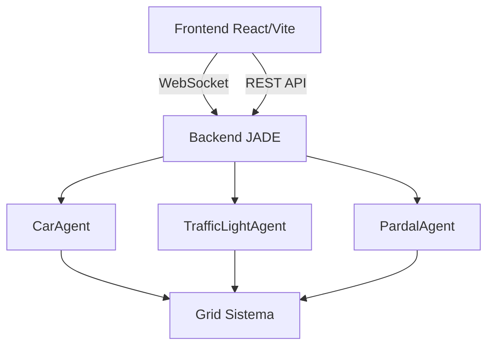
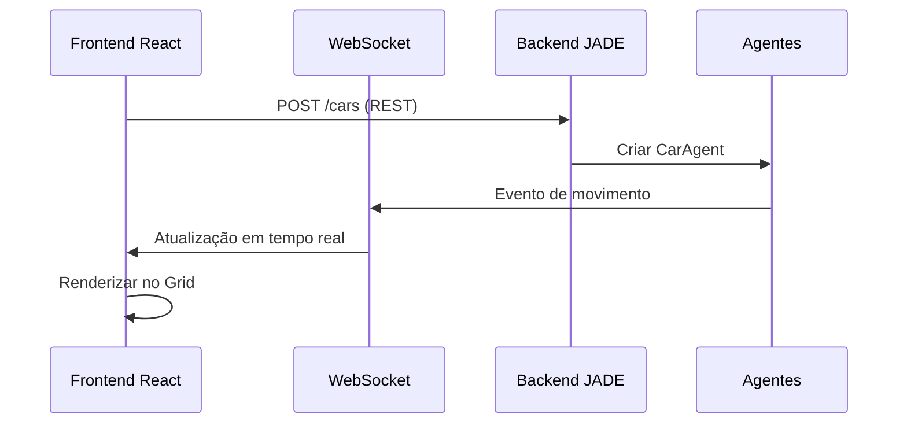

# 🚦 Sistema de Tráfego Inteligente SMA

**Projeto 2025.2_G2_SMA_TrafegoInteligente**

[](https://jade.tilab.com/)
[](https://reactjs.org/)
[](https://vitejs.dev/)
[](https://www.oracle.com/java/)

> **⚠️ Nota:** Este é um guia interno de desenvolvimento para organizar o trabalho entre **Breno** e **Lucas** durante a implementação do sistema.

---

## 📋 Índice

- [🎯 Visão Geral](#-visão-geral)
- [🏗️ Arquitetura](#️-arquitetura)
- [👥 Divisão de Responsabilidades](#-divisão-de-responsabilidades)
- [📁 Estrutura do Projeto](#-estrutura-do-projeto)
- [🔌 Comunicação Frontend-Backend](#-comunicação-frontend-backend)
- [🚀 Configuração e Execução](#-configuração-e-execução)
- [📋 Checklist de Desenvolvimento](#-checklist-de-desenvolvimento)
- [📚 Exemplos de Uso](#-exemplos-de-uso)
- [👤 Equipe](#-equipe)

---

## 🎯 Visão Geral

O **Sistema de Tráfego Inteligente** é uma simulação baseada em **Sistemas Multiagentes (JADE)** que modela o comportamento de um ambiente urbano inteligente em tempo real.

### 🎪 Agentes do Sistema

| Agente                | Ícone | Função   | Responsabilidades                                     |
| --------------------- | ----- | -------- | ----------------------------------------------------- |
| **CarAgent**          | 🚗    | Veículo  | Movimentação no grid, obediência às regras de tráfego |
| **TrafficLightAgent** | 🚦    | Semáforo | Controle de fluxo, alternância verde/vermelho         |
| **PardalAgent**       | 📸    | Sensor   | Detecção de eventos, solicitação de prioridade        |

### 🎯 Objetivos Técnicos

- **Backend:** Simulação multiagente em Java/JADE
- **Frontend:** Interface visual interativa em React/Vite
- **Comunicação:** WebSocket + REST API em tempo real
- **Visualização:** Grid dinâmico com atualização automática

---

## 🏗️ Arquitetura



---

## � Divisão de Responsabilidades

### 🎨 Lucas - Frontend Developer

<details>
<summary><strong>📦 Responsabilidades Principais</strong></summary>

#### 🔧 Componentes React

- **Grid System:** `Grid.jsx`, `Cell.jsx`, `ArrowOverlay.jsx`
- **Agent Icons:** `CarIcon.jsx`, `TrafficLightIcon.jsx`, `SensorIcon.jsx`
- **Interface Controls:** `Controls.jsx` com botões interativos
- **Layout Components:** `Header.jsx`, `Footer.jsx`

#### 📂 Arquivos de Trabalho

```
frontend/src/
├── components/
├── pages/
└── services/mapConfig.js
```

#### ✅ Tarefas Específicas

- [ ] Layout do grid estático responsivo
- [ ] Ícones visuais dos agentes
- [ ] Sistema de coordenadas visual
- [ ] Dados mockados para testes
- [ ] Interface de controles interativa

</details>

### ⚙️ Breno - Backend Developer & Integration

<details>
<summary><strong>🔗 Responsabilidades Principais</strong></summary>

#### 🖥️ Backend JADE

- **Agentes:** Modificação para emissão de eventos WebSocket
- **WebSocket Server:** `EventSocket.java` com `@ServerEndpoint`
- **REST Endpoints:** CRUD operations para o sistema

#### 🌐 API Endpoints

```http
GET    /spawns           # Listar pontos de spawn
POST   /cars             # Adicionar veículos
DELETE /cars/:id         # Remover veículos
GET    /status           # Status do sistema
```

#### 📡 WebSocket Events

```javascript
// Exemplo de evento de atualização
{
  "type": "CAR_UPDATE",
  "id": "Car1",
  "x": 1.0,
  "y": 0.0,
  "direction": "SUL",
  "timestamp": "2025-11-03T13:30:00-03:00"
}
```

#### ✅ Tarefas Específicas

- [ ] Implementação do `EventSocket.java`
- [ ] Modificação dos agentes JADE
- [ ] Criação dos endpoints REST
- [ ] Integração frontend (`api.js`, `ws.js`)
- [ ] Testes de comunicação em tempo real

</details>

---

## 📁 Estrutura do Projeto

```
📦 2025.2_G2_SMA_TrafegoInteligente/
├── 🌐 frontend/                    # React + Vite Application
│   ├── 📁 public/
│   ├── 📁 src/
│   │   ├── 🧩 components/
│   │   │   ├── 📊 Grid/
│   │   │   │   ├── Grid.jsx
│   │   │   │   ├── Grid.css
│   │   │   │   ├── Cell.jsx
│   │   │   │   ├── ArrowOverlay.jsx
│   │   │   │   └── index.js
│   │   │   ├── 🎮 Controls/
│   │   │   │   ├── Controls.jsx
│   │   │   │   └── Controls.css
│   │   │   ├── 🤖 Agents/
│   │   │   │   ├── CarIcon.jsx
│   │   │   │   ├── TrafficLightIcon.jsx
│   │   │   │   ├── SensorIcon.jsx
│   │   │   │   └── index.js
│   │   │   └── 🏗️ Layout/
│   │   │       ├── Header.jsx
│   │   │       └── Footer.jsx
│   │   ├── 📄 pages/
│   │   │   └── Dashboard.jsx
│   │   ├── 🔌 services/
│   │   │   ├── api.js            # REST API calls
│   │   │   ├── ws.js             # WebSocket connection
│   │   │   └── mapConfig.js      # Grid configuration
│   │   ├── 🛠️ utils/
│   │   │   ├── coordinates.js
│   │   │   └── constants.js
│   │   ├── App.jsx
│   │   ├── main.jsx
│   │   └── App.css
│   ├── package.json
│   └── vite.config.js
│
└── ⚙️ smart_traffic_control/       # Java + JADE Backend
    ├── 📁 src/main/java/com/smarttraffic/
    │   ├── 🤖 agents/
    │   │   ├── CarAgent.java
    │   │   ├── PardalAgent.java
    │   │   └── TrafficLightAgent.java
    │   ├── 📊 model/
    │   │   ├── Coordenada.java
    │   │   ├── Grid.java
    │   │   ├── TrafficConfig.java
    │   │   └── MainContainer.java
    │   └── 🔌 websocket/
    │       └── EventSocket.java    # WebSocket Server
    ├── pom.xml
    └── ...
```

---

## 🔌 Comunicação Frontend-Backend

### 📡 Fluxo de Dados



### 🌐 Endpoints da API

| Método   | Endpoint    | Descrição               | Exemplo                         |
| -------- | ----------- | ----------------------- | ------------------------------- |
| `GET`    | `/spawns`   | Lista pontos de entrada | `[{x: 0, y: 0, type: "spawn"}]` |
| `POST`   | `/cars`     | Adiciona veículo        | `{id: "Car1", spawn: "0,0"}`    |
| `DELETE` | `/cars/:id` | Remove veículo          | `204 No Content`                |
| `GET`    | `/status`   | Status do sistema       | `{active: true, cars: 5}`       |

### 📨 Mensagens WebSocket

#### 🚗 Atualização de Veículo

```json
{
  "type": "CAR_UPDATE",
  "id": "Car1",
  "x": 1.0,
  "y": 0.0,
  "direction": "SUL",
  "speed": 1.0,
  "timestamp": "2025-11-03T10:30:00Z"
}
```

#### 🚦 Estado do Semáforo

```json
{
  "type": "TRAFFIC_LIGHT_UPDATE",
  "id": "SEMAFORO_1_0_S",
  "state": "VERDE",
  "duration": 30000,
  "timestamp": "2025-11-03T10:30:00Z"
}
```

#### 📸 Evento do Sensor

```json
{
  "type": "SENSOR_EVENT",
  "id": "PARDAL_1",
  "detected": ["Car1", "Car2"],
  "priority_requested": true,
  "timestamp": "2025-11-03T10:30:00Z"
}
```

---

## 🚀 Configuração e Execução

### 📋 Pré-requisitos

- **Node.js** 18+
- **Java** 17+
- **Maven** 3.8+
- **JADE** 4.5.0

### 🔧 Setup do Frontend

```bash
# Navegar para o frontend
cd frontend

# Instalar dependências
npm install

# Executar em modo desenvolvimento
npm run dev
```

### ⚙️ Setup do Backend

```bash
# Navegar para o backend
cd smart_traffic_control

# Compilar o projeto
mvn clean compile

# Executar o sistema JADE
mvn exec:java -Dexec.mainClass="com.smarttraffic.MainContainer"
```

### 🌐 URLs de Acesso

| Serviço       | URL                          | Descrição                 |
| ------------- | ---------------------------- | ------------------------- |
| **Frontend**  | `http://localhost:5173`      | Interface React           |
| **WebSocket** | @ServerEndpoint("/events")| Comunicação em tempo real |
| **REST API**  | `http://localhost:8080/api`  | Endpoints HTTP            |

---

## 📋 Checklist de Desenvolvimento

### 🎨 Lucas - Frontend Tasks

- [ ] **Grid System**

  - [ ] Criar `Grid.jsx` com layout responsivo
  - [ ] Implementar `Cell.jsx` para células individuais
  - [ ] Adicionar `ArrowOverlay.jsx` para direções
  - [ ] Criar `Grid.css` com estilos

- [ ] **Agent Icons**

  - [ ] `CarIcon.jsx` com diferentes direções
  - [ ] `TrafficLightIcon.jsx` com estados (verde/vermelho)
  - [ ] `SensorIcon.jsx` para pardais

- [ ] **Interface Controls**

  - [ ] `Controls.jsx` com botões de ação
  - [ ] Formulário para adicionar carros
  - [ ] Painel de status do sistema

- [ ] **Configuration**
  - [ ] `mapConfig.js` com coordenadas do grid
  - [ ] Sistema de coordenadas visual
  - [ ] Dados mockados para testes

### ⚙️ Breno - Backend & Integration Tasks

- [ ] **WebSocket Server**

  - [ ] Implementar `EventSocket.java`
  - [ ] Configurar `@ServerEndpoint("/events")`
  - [ ] Sistema de broadcast de eventos

- [ ] **Agent Integration**

  - [ ] Modificar `CarAgent.java` para eventos WS
  - [ ] Atualizar `TrafficLightAgent.java`
  - [ ] Integrar `PardalAgent.java`

- [ ] **REST API**

  - [ ] Endpoint `GET /spawns`
  - [ ] Endpoint `POST /cars`
  - [ ] Endpoint `DELETE /cars/:id`
  - [ ] Endpoint `GET /status`

- [ ] **Frontend Integration**
  - [ ] Criar `api.js` para REST calls
  - [ ] Implementar `ws.js` para WebSocket
  - [ ] Testes de comunicação

---

## 📚 Exemplos de Uso

### 🎨 Configuração Visual do Grid

```javascript
// mapConfig.js
export const gridConfig = {
  cells: [
    { x: 0, y: 0, type: "spawn", color: "#90EE90" },
    { x: 1, y: 0, type: "intersection", color: "#D3D3D3" },
    { x: 2, y: 0, type: "exit", color: "#FFB6C1" },
    // ...
  ],
  agents: {
    cars: [],
    trafficLights: [{ id: "SEMAFORO_1_0_S", x: 1, y: 0, state: "VERDE" }],
  },
};
```

### 🔌 Integração WebSocket

```javascript
// ws.js
class WebSocketService {
  constructor() {
    this.ws = new WebSocket("ws://localhost:8081/events");
    this.subscribers = new Map();
  }

  subscribe(eventType, callback) {
    if (!this.subscribers.has(eventType)) {
      this.subscribers.set(eventType, []);
    }
    this.subscribers.get(eventType).push(callback);
  }

  onMessage(event) {
    const data = JSON.parse(event.data);
    const callbacks = this.subscribers.get(data.type) || [];
    callbacks.forEach((callback) => callback(data));
  }
}
```

### 🎯 Regras Visuais do Sistema

| Tipo de Célula   | Cor               | Ícone | Descrição               |
| ---------------- | ----------------- | ----- | ----------------------- |
| **spawn**        | 🟩 Verde-claro    | 🏁    | Entrada de veículos     |
| **exit**         | 🟥 Vermelho-claro | 🏁    | Saída do sistema        |
| **intersection** | ⬜ Cinza          | 🚦    | Cruzamento com semáforo |
| **road**         | ⬛ Preto          | 🛣️    | Rua normal              |
| **sensor**       | 🟦 Azul           | 📸    | Sensor de tráfego       |

---

## 👤 Equipe

### 👨‍💻 **Breno Lucena**

- **Função:** Backend Developer & System Integration
- **Responsabilidades:** Java/JADE, WebSocket, REST API
- **Contato:** [GitHub Profile](https://github.com/breno)

### 👨‍💻 **Lucas [Sobrenome]**

- **Função:** Frontend Developer & UI/UX
- **Responsabilidades:** React/Vite, Grid Visual, Interface
- **Contato:** [GitHub Profile](https://github.com/lucas)

---

## 🔄 Workflow de Desenvolvimento

```bash
# 1. Criar branch para feature
git checkout -b feature/nome-da-feature

# 2. Desenvolver e testar
# ... código ...

# 3. Commit das alterações
git add .
git commit -m "feat: descrição da feature"

# 4. Push e Pull Request
git push origin feature/nome-da-feature
```

---

## 📝 Próximos Passos

1. **🎨 Lucas:** Iniciar desenvolvimento do grid visual
2. **⚙️ Breno:** Implementar WebSocket server
3. **🔗 Integração:** Conectar frontend com backend
4. **🧪 Testes:** Validar comunicação em tempo real
5. **🚀 Deploy:** Preparar ambiente de produção

---

**🎯 Meta:** Sistema funcional com visualização em tempo real do tráfego inteligente multiagente!
